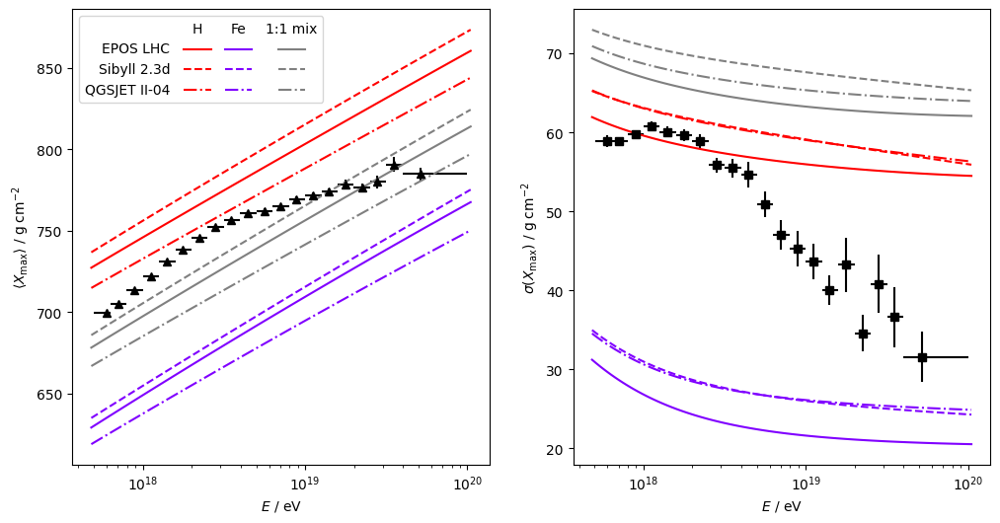

matrix legend is simply a plot legend for a cartesian product of two label sets
(models, parameter values, etc). i often want to create this kind of thing to
save space and show the cartesian-product-ness of the plots explicitly, but
so far i have only seen people do that manually. so, in a couple of hours of 
tweaking [Matplotlib](https://matplotlib.org/)'s 
[Legend](https://github.com/matplotlib/matplotlib/blob/01cfcb08d4c41d161a679c8e3215dbc6cf20f4f8/lib/matplotlib/legend.py#L342)
class i managed to get it to auto-magically produce the following

i'm yet to test it in more real-world scenarios, but it is fairly thin
and should therefore play well with most other Matplotlib features.
