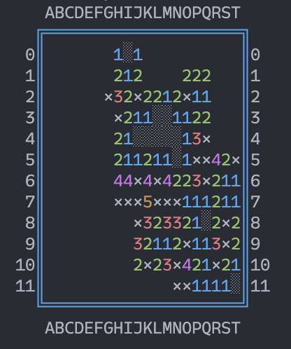
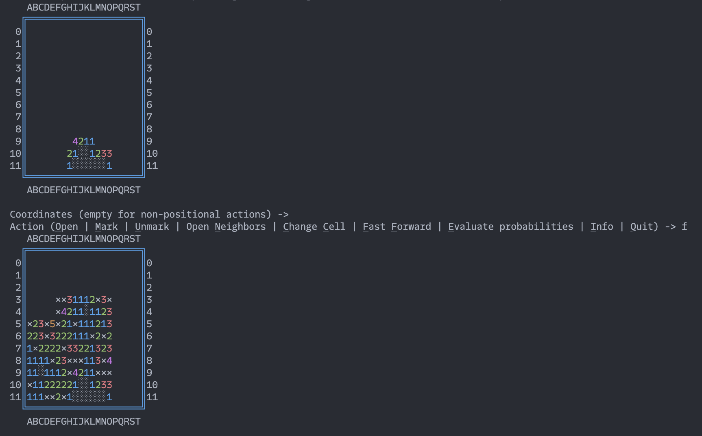
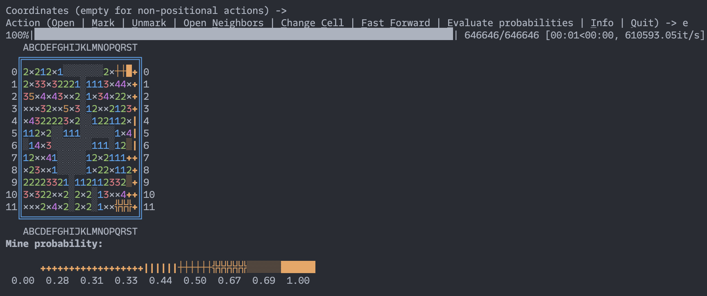

i used to love [minesweeper](https://minesweeperonline.com/) and played it a lot back in the day.
but i found myself frustrated with two things:
- making "trivial" progress, when mine locations are obvious
- guessing mine locations in the endgame, when they are non-deterministic

from this, an idea was born to make a [tool-assisted](https://en.wikipedia.org/wiki/Tool-assisted_speedrun)
minesweeper.

first of all, i made a playground for myself, a [TUI](https://en.wikipedia.org/wiki/Text-based_user_interface)
minesweeper, which was a nice project in and of itself: ASCII character set with
[ANSI codes](https://en.wikipedia.org/wiki/ANSI_escape_code) for text/background color and decoration make
for a nice expressive display.

then, i added two features to address the two mentioned frustrations

## fast-forwarding

if an N-mine cell has K marked mines nearby and N-K unopened neighbor cells, assuming the first K marked mines
are correct, we can safely open all N-K neighbors. by doing this in the loop we can "fast-forward" the game until
the next non-trivial situation occurs.

this feature is very simple so that it doesn't feel like cheating, but also eliminates the most boring parts
of the game.

## brute-force search

who needs a "smart" or "intelligent" solution when our modern computers are fast enough to chew through
millions of possibilities? i wanted to make a deliberately simple bruteforce solver; the algorithm is:
- generate all possible mine positions in unopened and unmarked cells
- filter out those that do not satisfy the constraints put by currently open cells
- for each unopened cell, count "marginal" probability of a mine: amount of valid configurations with mine
  in it / total number of valid configurations

the results are visualized on the board like this:

here it finds a guaranteed mine at `S0` (which is very easy to infer as well), but for all other unopened cells
it gives only probabilities. this means that there is no clever inference to find them, only guessing is
left at this point. this guessing, however, is now guided by probabilities, which in theory gives the player an
advantage.

of course, it's incredibly ineffective, so only feasible in the endgame. but the endgame is when the bulk of
guesswork typically occurs, so it's justified.
