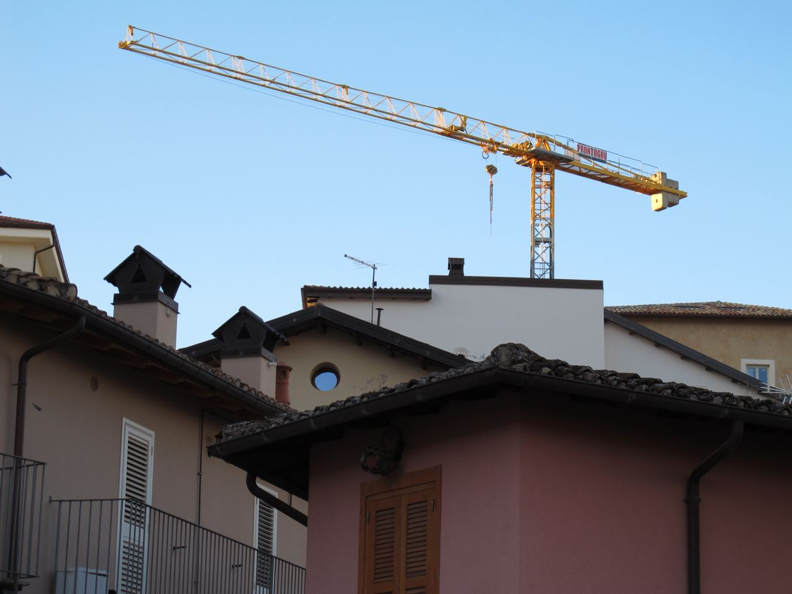

for some time i have been wanting to organize the multitude of my affairs into one place to
keep myself from forgetting parts of my experience and/or identity. i also like inventing
bicycles, so for my little personal page i'm writing a custom website with Rust. it is
inspired by [fasterthanlime blog](https://fasterthanli.me/) and countless others
minimalistic, hacky, wonderful blogs and personal pages.

## features
- the site is an [axum](https://crates.io/crates/axum) app with [askama](https://crates.io/crates/askama)
  templates
- for the [project collection](/projects) i keep everything in markdown and render it into html on the fly.
  this involves some hacky extensions, as well as:
  - code blocks with highlighting by [highlight.js](https://highlightjs.org/):
    ```python
      def greet(name: str):
          print(f"hello, {name}")
    ```
  - latex-style math with [MathJax](https://www.mathjax.org/):
  $\displaystyle \int_{-\infty}^{\infty} e^{x^2} dx$
  - per-project media files:
  
- projects have a [tag system](/tags) with a simplistic faceted classification
- [photo gallery](/gallery) is a "diy instagram" that i made to host my photography. it even has a subtle
  dynamic color background made from a photo's color palette!
