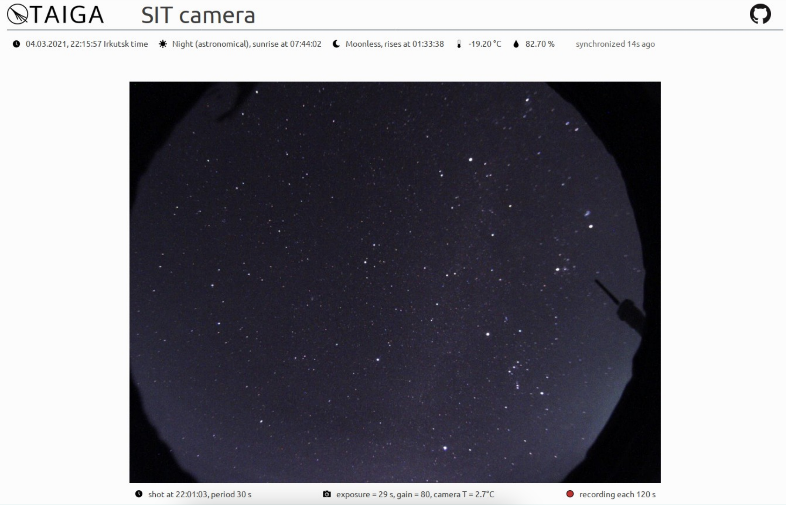

in 2020 i assisted in testing a
[Small Imaging Telescope (SIT)](https://indico.cern.ch/event/981823/contributions/4295451/attachments/2249881/3816563/poster_521.pdf)
prototype at the [TAIGA observatory](https://taiga-experiment.info/). one of my tasks was to hook
a small [ZWO astocamera](https://astronomy-imaging-camera.com/product/asi120mm-s/) to an
experiment's computer and make a user-friendly web interface to quickly view
- image feed from the camera to assess observation conditions (clouds, sun, moon and zodiac lighs, etc)
- data from onboard sensors such as temperature and humidity

i wanted to use python for web stuff, but the tricky part was connecting to camera's driver. this lead
to the creation of [`pyindigo`](/projects/pyindigo). the rest was much easier, but i learned a lot about
web tech in the process. and here's the frontend i built (for some reason with react, don't ask!):

there was an idea to use this camera's images for precise star tracking to figure out
atmospheric extinction. that data could then be used to reconstruct atmospheric conditions
for $\gamma$-ray signal reconstruction. unfortunately, as far as i know this never came to be!
